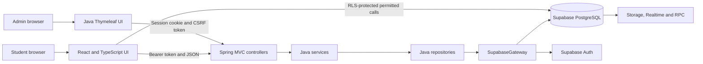

# TAKKA Campus Connect: Java Project Viva and Presentation Guide

> Use this guide to understand the project, not to memorize claims you cannot explain. If a teacher asks who created a particular part, answer honestly and then demonstrate that you understand how it works.

## 1. The 30-second explanation

TAKKA Campus Connect is a full-stack university discovery and student community platform for Myanmar. The main backend is a Java 21 Spring Boot application. It handles HTTP requests, security, validation, administration, moderation, account operations, and communication with Supabase. The student-facing web interface is built with React and TypeScript, while the administrator interface is rendered by Java using Thymeleaf. Supabase provides PostgreSQL, authentication, row-level security, file storage, realtime features, and database functions. The frontend is deployed on Vercel and the Java backend is deployed on Railway.

This is accurately described as **a Java Spring Boot full-stack project with a React client**. It is not a Java-only project, because a modern browser cannot directly render Java source code as its user interface.

## 2. What problem the project solves

Students in Myanmar often need information from separate, inconsistent sources. TAKKA puts several workflows in one system:

- Discover universities and departments.
- Compare and match universities using student preferences.
- Register as a current or prospective student.
- Ask questions and post answers in a student community.
- Connect with students and join university groups.
- Find opportunities such as scholarships and events.
- Report unsafe or inappropriate content.
- Let authorized administrators verify users, moderate reports and posts, maintain university data, and review an audit trail.

## 3. Exact technology stack

The versions below come from `backend/pom.xml` and `package.json`.

| Layer                | Technology                  |                          Version | Purpose                                                         |
| -------------------- | --------------------------- | -------------------------------: | --------------------------------------------------------------- |
| Backend language     | Java                        |                               21 | Main server-side programming language                           |
| Backend framework    | Spring Boot                 |                            4.1.1 | Application configuration, dependency injection, server startup |
| Web framework        | Spring Web MVC              |           managed by Spring Boot | Controllers, routes, request/response handling                  |
| Security             | Spring Security             |           managed by Spring Boot | Authentication filters, authorization, sessions, CSRF and CORS  |
| Validation           | Jakarta Bean Validation     |           managed by Spring Boot | Validates form and API input with annotations                   |
| Admin templates      | Thymeleaf                   |           managed by Spring Boot | Server-rendered administrator pages                             |
| Monitoring           | Spring Boot Actuator        |           managed by Spring Boot | Health endpoint for deployment monitoring                       |
| Build tool           | Maven                       | wrapper/repository configuration | Downloads dependencies, compiles Java and runs tests            |
| Frontend library     | React                       |                           19.2.0 | Student-facing component UI                                     |
| Frontend language    | TypeScript                  |                            5.8.3 | Typed browser application code                                  |
| App/router framework | TanStack Start              |                         1.168.32 | Full application structure and server-capable React routing     |
| Router               | TanStack Router             |                         1.170.18 | Type-safe pages and navigation                                  |
| Server-state cache   | TanStack Query              |                          5.101.1 | Loading, caching and refreshing remote data                     |
| Bundler              | Vite                        |                            8.1.5 | Frontend development and production build                       |
| CSS framework        | Tailwind CSS                |                            4.2.1 | Responsive visual styling                                       |
| UI primitives        | Radix UI                    |        package-specific versions | Accessible dialogs, selects and menus                           |
| Icons                | Lucide React                |                          0.575.0 | Consistent interface icons                                      |
| Notifications        | Sonner                      |                            2.0.7 | Success and error toast messages                                |
| Browser database SDK | Supabase JS                 |                          2.110.8 | Safe client authentication and permitted data operations        |
| Database             | PostgreSQL through Supabase |                  managed service | Relational application data                                     |
| Auth and platform    | Supabase                    |                           hosted | Auth, RLS, Storage, Realtime, REST and RPC                      |
| Frontend hosting     | Vercel                      |                           hosted | Primary React deployment                                        |
| Java hosting         | Railway                     |                           hosted | Spring Boot API, admin console and fallback frontend            |

## 4. What is genuinely Java in this project?

The Java application is under `backend/src/main/java/com/takka` and contains 98 production Java source files. The Java test suite is under `backend/src/test/java` and contains 34 test source files.

Java is responsible for:

- Starting and configuring the Spring Boot server.
- Mapping URLs to controller methods.
- Validating incoming forms and API bodies.
- Converting JSON data into typed Java models and records.
- Executing business rules in service classes.
- Constructing safe, typed Supabase REST queries in repositories.
- Authenticating bearer tokens for member API requests.
- Creating and restoring secure sessions for administrators.
- Enforcing administrator roles and permissions.
- Protecting state-changing admin forms with CSRF tokens.
- Moderating accounts, reports, posts, opportunities, photos, and university data.
- Writing administrative actions to an audit trail.
- Rendering the entire admin interface with Thymeleaf templates.
- Exposing deployment health information with Actuator.
- Providing a controlled fallback to the React frontend.

The React application is not evidence that Java is absent. It is the presentation/client layer that calls the Java server and Supabase. In a full-stack system, different tools can be used for the layers where they are strongest.

## 5. Main architecture



The backend follows a layered architecture:

1. **Controller layer** receives HTTP requests and selects an action.
2. **Form/request layer** describes and validates input.
3. **Service layer** contains business rules and authorization decisions.
4. **Repository layer** constructs data queries.
5. **Gateway layer** performs HTTP communication with Supabase.
6. **Mapper/model layer** converts external JSON into typed Java objects.
7. **View layer** renders administrator HTML through Thymeleaf.

This separation makes classes easier to reason about and test. A controller should not contain raw database query construction, and a template should not decide authorization rules.

## 6. Important Java packages

| Package                      | Responsibility                                  |
| ---------------------------- | ----------------------------------------------- |
| `com.takka.account`          | Account status and account-related API behavior |
| `com.takka.admin.console`    | Admin controllers and console pages             |
| `com.takka.admin.form`       | Validated admin form input                      |
| `com.takka.admin.mapper`     | Converts Supabase JSON into Java models         |
| `com.takka.admin.model`      | Records, enums, filters and page models         |
| `com.takka.admin.repository` | Data access/query construction                  |
| `com.takka.admin.service`    | Admin business logic and moderation             |
| `com.takka.admin.session`    | Admin login, session creation and restoration   |
| `com.takka.admin.support`    | Shared admin exceptions and helpers             |
| `com.takka.common`           | Shared utility code                             |
| `com.takka.config`           | Spring and deployment configuration             |
| `com.takka.frontend`         | Safe frontend fallback routing                  |
| `com.takka.reports`          | Member report API and report rules              |
| `com.takka.security`         | Security filters and authenticated identity     |
| `com.takka.supabase`         | Supabase HTTP gateway and proxy behavior        |

## 7. Important files to show during the viva

Open these files in this order if the teacher asks to see implementation:

1. `backend/pom.xml` — proves Java 21, Spring Boot, Security, MVC, Thymeleaf, Validation and tests.
2. `backend/src/main/java/com/takka/TakkaApplication.java` — Java entry point with `@SpringBootApplication`.
3. `backend/src/main/java/com/takka/config/SecurityConfig.java` — two security filter chains and access policy.
4. `backend/src/main/java/com/takka/supabase/SupabaseGateway.java` — Java-to-Supabase integration.
5. `backend/src/main/java/com/takka/security/SupabaseAuthenticationFilter.java` — bearer-token authentication.
6. `backend/src/main/java/com/takka/admin/session/AdminSessionService.java` — administrator authentication.
7. `backend/src/main/java/com/takka/admin/console/ConsoleReportsController.java` — an MVC controller.
8. `backend/src/main/java/com/takka/admin/service/ReportModerationService.java` — business logic.
9. `backend/src/main/java/com/takka/admin/repository/ReportRepository.java` — repository/data access.
10. `backend/src/test/java` — automated Java tests.
11. `backend/src/main/resources/templates` — Java-rendered Thymeleaf admin pages.
12. `supabase/migrations` — database functions, policies and indexes.

Do not only show the React pages. Begin with `pom.xml` and `TakkaApplication.java` so the Java architecture is immediately clear.

## 8. How requests move through the system

### A. Member submits a report

1. React obtains the signed-in user's Supabase access token.
2. The browser sends a JSON request with `Authorization: Bearer <token>`.
3. `SupabaseAuthenticationFilter` validates the token and establishes the user identity.
4. `ReportController` receives and validates the request.
5. `ReportService` applies reporting rules.
6. The Supabase integration writes the report to PostgreSQL.
7. Java returns a JSON result with the correct HTTP status.

### B. Administrator signs in

1. The admin opens `/admin/login`, rendered by Thymeleaf.
2. Credentials are submitted to the Java application.
3. `AdminSessionService` authenticates them through Supabase Auth.
4. Java verifies that the user also has an active row in `admin_users`.
5. Java creates a stateful admin session and secure cookie.
6. Spring Security restores the authority on later admin requests.
7. A moderator or super-admin can access only operations allowed for that role.

Having a normal Supabase account does not automatically make somebody an administrator.

### C. Administrator moderates a report

1. `ConsoleReportsController` receives the form submission.
2. Spring Security checks the admin session and CSRF token.
3. Jakarta Validation checks the submitted fields.
4. `ReportModerationService` verifies the requested state transition.
5. `ReportRepository` loads or updates data through `SupabaseGateway`.
6. The action is recorded in the audit log.
7. Java redirects to an admin page with a success or error message.

### D. Student selects a university and department

1. The frontend loads the published university catalog.
2. The selected university ID becomes the filter for departments.
3. TanStack Query caches and refreshes the result.
4. A responsive Radix-based selector displays valid choices on desktop and mobile.
5. Registration stores identifiers, not display names, preserving relational integrity.

## 9. Java and object-oriented concepts demonstrated

### Classes and objects

Controllers, services, repositories, gateways, filters and configuration components are Java classes instantiated and managed by Spring.

### Encapsulation

Each class owns one responsibility. For example, authentication details stay in session/security classes while moderation rules stay in moderation services.

### Abstraction

Controllers call services without needing to know how HTTP calls to Supabase are assembled. Services call repositories without rendering HTML themselves.

### Dependency injection

Spring supplies a class's dependencies through constructor injection. This avoids manually creating tightly coupled objects with `new` throughout the application and makes unit testing easier.

### Records

Java records are appropriate for immutable data carriers such as views, summaries or mapped query results. Records automatically provide a constructor, accessors, `equals`, `hashCode` and `toString`.

### Enums

Enums such as `SUPER_ADMIN` and `MODERATOR` represent a closed set of valid states. They are safer than unrestricted strings and prevent spelling variants from silently changing behavior.

### Generics

Generic types allow reusable, type-safe containers and collection processing without losing the element type.

### Annotations

Examples include `@SpringBootApplication`, `@Controller`, `@RestController`, `@Service`, `@GetMapping`, `@PostMapping`, `@Valid` and validation constraints. Spring reads these annotations at runtime to configure application behavior.

### Exception handling

Expected remote, validation and authorization failures are translated into controlled HTTP responses or admin error messages instead of exposing stack traces to users.

### Collections and streams

Lists, maps, optionals and stream operations are used when mapping, filtering and aggregating typed results.

### Immutability

Configuration and data-transfer values are kept immutable where practical. This reduces accidental state changes and makes concurrent web requests safer.

## 10. Why these technologies were selected

### Why Java and Spring Boot?

- Java is strongly typed, widely used for enterprise servers and has mature tooling.
- Spring MVC gives a clear controller/service/repository structure.
- Spring Security provides tested security primitives instead of custom login middleware.
- Bean Validation keeps validation rules declarative and reusable.
- Maven produces a repeatable build and executable JAR.
- JUnit and Spring test utilities support automated testing.

### Why not plain Java Servlets only?

Servlets could implement the server, but much more routing, dependency wiring, validation, security and error handling would need to be written manually. Spring Boot still runs on the Java web platform; it provides higher-level, tested abstractions.

### Why not JavaFX or Swing?

JavaFX and Swing build desktop applications. TAKKA must work from a browser on phones and laptops without installing a desktop program. A web application is therefore a better delivery model.

### Why not JSP for the whole frontend?

JSP could render pages on the server, but the student hub needs highly interactive filtering, responsive selectors, realtime state and client-side navigation. React is better suited to this experience. Thymeleaf is retained for the smaller, security-sensitive admin console because server-rendered forms are straightforward and pair well with Spring Security.

### Why React and TypeScript?

React breaks a complex interface into reusable components. TypeScript catches many property and API-shape mistakes before deployment. TanStack Router and Query provide typed navigation and disciplined remote-state caching.

### Why not make the entire backend Node.js?

Node.js would be a valid alternative, but it would not meet the goal of demonstrating a Java backend. Java/Spring gives strong compile-time typing, mature server security, annotation-based validation and an architecture suitable for the exam topic.

### Why Supabase instead of a local MySQL database?

Supabase still uses a relational PostgreSQL database, but also provides hosted authentication, Row Level Security, storage, realtime subscriptions, REST access and database functions. A local MySQL server would require separate hosting, authentication, storage and authorization infrastructure.

### Why not Firebase?

Firebase is useful, but its main Firestore model is document-oriented. This project has strongly relational data: universities have departments, users create posts, questions have answers, and reports target content. PostgreSQL foreign keys, joins and SQL constraints fit this model naturally.

### Why is JPA/Hibernate not used?

The Java backend communicates with hosted Supabase through its REST/Auth APIs rather than opening a direct JDBC connection. Repository classes still provide a data-access layer, and mappers convert JSON into Java types. This reduces database credential exposure and works with Supabase's API model, but it sacrifices some JPA benefits such as entity relationships and compile-time query tooling. If the exam requires direct JDBC or JPA specifically, describe this clearly rather than claiming it is used.

### Why both direct Supabase access and a Java API?

Low-risk member operations can use the Supabase client under Row Level Security. Privileged operations, admin workflows, custom security checks and service-role access must go through Java. This avoids routing every simple read through the server while keeping privileged secrets and decisions off the browser.

### Why Railway and Vercel?

Vercel is optimized for modern frontend deployment. Railway can run the persistent Java Spring Boot service and executable JAR. Separating the deployments lets each platform handle the workload it supports well. The Railway service can also serve a controlled frontend fallback when the primary frontend is unreachable.

## 11. Security model

Authentication answers **who the user is**. Authorization answers **what that user may do**.

The application has two ordered Spring Security filter chains:

- **Admin chain:** stateful server session, login form, role authority, CSRF protection.
- **Member/API chain:** stateless bearer-token authentication, CORS policy, JSON/API behavior.

Important protections:

- Supabase JWT/access tokens establish member identity.
- Admin access requires both authentication and an active `admin_users` record.
- Admin roles distinguish moderator and super-admin permissions.
- CSRF tokens protect state-changing server-rendered admin forms.
- CORS allows configured frontend origins instead of every website.
- PostgreSQL Row Level Security limits direct browser data access.
- The Supabase service-role key stays on the Java server and must never appear in frontend code or Git.
- Database functions check `auth.uid()`, user status and ownership before privileged changes.
- Public/anonymous execution is revoked for security-sensitive functions.
- An audit log preserves who performed important moderation actions.
- Input validation and controlled status transitions reduce malformed or invalid writes.

## 12. CSRF, CORS, JWT and sessions

| Term             | Meaning in TAKKA                                                                                            |
| ---------------- | ----------------------------------------------------------------------------------------------------------- |
| CSRF             | Stops another website from secretly submitting an authenticated admin form. A valid token is required.      |
| CORS             | Controls which browser origins may call the API. It is a browser security policy, not user authentication.  |
| JWT/access token | A signed token representing a logged-in member. The API validates it before trusting the identity.          |
| Session          | Server-side admin login state referenced by a secure cookie. Useful for Thymeleaf pages and form workflows. |
| RLS              | PostgreSQL policies that decide which rows the current authenticated user may read or change.               |

The project previously exposed the difference between CORS and JSON handling: a blocked CORS response was plain text, but the frontend attempted to parse it as JSON. The robust behavior is to configure the allowed origin correctly and handle non-JSON error responses without crashing.

## 13. Database design

The production database contains 33 application tables. Major domains include:

- Identity and profiles.
- Admin users and audit logs.
- Universities and departments.
- Posts, comments, questions and answers.
- Reports and moderation records.
- Connections, buddies and university groups.
- Opportunities and saved opportunities.
- University photos and verification data.

Relational design matters because IDs and foreign keys connect these domains. Indexes are added to frequently searched and foreign-key columns so PostgreSQL does not need to scan every row for common joins.

See `docs/database-schema-visualizer.png` for the full visual schema and `PROJECT_FLOWCHART.md` for system flows.

### Honest migration limitation

The repository contains later feature migrations but not the original baseline migrations that created every core production table. Production has more migration-history entries than the repository. Therefore, a completely empty Supabase project cannot currently be reproduced from repository migrations alone. This should be described as a known reproducibility issue and a future task: export a reviewed baseline schema, then test rebuilding a fresh environment.

## 14. Main HTTP endpoints

| Area           | Example route              | Purpose                                     |
| -------------- | -------------------------- | ------------------------------------------- |
| Health         | `/actuator/health`         | Deployment health check                     |
| Account        | `/api/account/status`      | Current account state                       |
| Reports        | `/api/reports`             | Submit or inspect member reports            |
| Supabase proxy | `/api/supabase/**`         | Controlled Auth/REST proxy behavior         |
| Admin login    | `/admin/login`             | Admin authentication page and submit action |
| Admin overview | `/admin`                   | Dashboard summary                           |
| Reports admin  | `/admin/reports`           | Review and resolve reports                  |
| Members admin  | `/admin/members`           | Verify, block, unblock or delete accounts   |
| Posts admin    | `/admin/posts`             | Remove and restore content                  |
| Universities   | `/admin/universities`      | Maintain university directory               |
| Catalog        | `/admin/catalog`           | Maintain catalog data                       |
| Opportunities  | `/admin/opportunities`     | Moderate opportunities                      |
| Photos         | `/admin/university-photos` | Moderate university images                  |
| Audit          | `/admin/audit`             | Review administrative actions               |

Use the actual controller annotations as the final authority if a route changes.

## 15. Build, test and run commands

### Java backend

```powershell
cd backend
.\mvnw.cmd clean test
.\mvnw.cmd spring-boot:run
```

### Frontend

```powershell
npm install
npm run lint
npm run build
npm run dev
```

### Git evidence

```powershell
git status
git log --oneline -10
git show --stat HEAD
```

At the final audit, Maven ran **233 tests with 0 failures, 0 errors and 0 skipped tests**. The frontend production build and lint also passed, and the production dependency audit reported no known runtime vulnerabilities. Test counts can change when new tests are added, so run the commands again before presenting.

## 16. Testing strategy

The project uses several levels of verification:

- **Unit tests** isolate services, mappers and business behavior.
- **Controller/security tests** check routes, status codes, permissions and form behavior.
- **Repository/gateway tests** check generated query and remote-response handling.
- **Frontend lint and TypeScript build** catch invalid code and type mismatches.
- **Responsive browser tests** exercise desktop and phone workflows.
- **Deployment smoke tests** check health, login pages, CORS and API error handling.
- **Database advisors** identify missing indexes and security-policy concerns.

Tests reduce risk; they do not mathematically prove there are no bugs. Successful login flows still require valid private test credentials, which should not be placed in source code.

## 17. Known limitations and honest improvement plan

A strong viva answer includes limitations instead of pretending the software is perfect.

1. **Baseline migration gap:** Add and verify a complete sanitized baseline schema for fresh installations.
2. **Sparse community data:** The live system currently has questions but few or no answers, opportunities, buddy profiles and approved photos. Seed realistic demonstration data without inventing real users.
3. **External service dependency:** Supabase, Railway and Vercel availability affect the system. Add clearer outage states, retries only where safe, and monitoring.
4. **Vercel reachability:** Some networks have intermittently timed out. Railway's controlled fallback helps, but DNS/platform/network diagnosis and observability should continue.
5. **Authentication end-to-end testing:** Automated tests cover code paths, but a final presentation rehearsal needs dedicated non-secret demo accounts.
6. **Leaked-password protection:** Enable Supabase's leaked-password protection as production hardening.
7. **No JPA layer:** REST integration fits the hosted architecture, but a direct-database version could use JPA if an academic requirement demands ORM entities.

## 18. Likely teacher questions and model answers

### 1. Is this really a Java project?

Yes. The server, security, admin console, validation, business services, repositories, Supabase gateway and automated backend tests are Java 21 with Spring Boot. The public browser interface uses React/TypeScript. It is a Java full-stack project, not a Java-only project.

### 2. Where does the Java program start?

`TakkaApplication.java` contains the `main` method. `SpringApplication.run(...)` starts the Spring application context and embedded web server.

### 3. What does `@SpringBootApplication` do?

It combines configuration, component scanning and auto-configuration. Spring finds annotated components and configures common framework behavior from dependencies and properties.

### 4. What is dependency injection?

A class declares the dependencies it needs, usually in its constructor, and Spring provides those objects. This reduces coupling and makes tests able to substitute controlled dependencies.

### 5. What is MVC?

Model-View-Controller separates data/state, presentation and request handling. In the admin console, controllers process requests, models hold view data and Thymeleaf templates produce HTML.

### 6. What is the difference between a controller, service and repository?

A controller handles HTTP details. A service implements business rules. A repository loads and stores data. Keeping them separate prevents one large class from doing everything.

### 7. Why use `@RestController` sometimes and `@Controller` elsewhere?

`@RestController` returns response bodies such as JSON. `@Controller` commonly returns a Thymeleaf view name or redirect for server-rendered pages.

### 8. What is REST?

REST models resources over HTTP using routes, methods, representations and status codes. For example, GET reads data and POST submits a state-changing operation.

### 9. What is JSON?

JSON is the text data format exchanged between the browser, Java API and Supabase. Java maps it into typed values rather than treating the entire response as unstructured text.

### 10. Why use POST instead of GET for moderation actions?

GET should be safe and not change server state. Blocking a member or resolving a report changes data, so POST is appropriate and can be protected with CSRF.

### 11. What is Bean Validation?

It is annotation-based input validation. Constraints declare rules such as required values or valid sizes, and `@Valid` asks Spring to evaluate them before business logic proceeds.

### 12. What is authentication versus authorization?

Authentication identifies the user. Authorization checks whether that identified user has permission to perform an action.

### 13. How does member authentication work?

Supabase Auth signs the user in and issues an access token. The browser sends it as a bearer token. Java's authentication filter validates the token and establishes the request identity.

### 14. How does admin authentication work?

Java authenticates the credentials through Supabase and then checks for an active administrator record. It creates a server-side session used by the Thymeleaf admin console.

### 15. Why not use the same auth style for both?

The React client naturally uses stateless bearer tokens. The server-rendered admin console benefits from a stateful session, secure cookie and CSRF-protected forms. Spring supports both through separate security chains.

### 16. What is CSRF?

Cross-Site Request Forgery tricks a logged-in browser into sending an unwanted request. The admin console requires a server-issued CSRF token for state-changing forms.

### 17. What is CORS?

Cross-Origin Resource Sharing tells browsers which origins may call an API. It does not replace authentication. The backend must explicitly allow the deployed frontend origin.

### 18. What caused the “Invalid CORS request is not valid JSON” error?

The server rejected the browser origin with a plain-text CORS response, but client code tried to parse every failure as JSON. The fix involved correct allowed-origin configuration and safer response parsing.

### 19. What is a JWT?

A JSON Web Token is a signed set of claims used to represent an authenticated identity. The signature prevents clients from safely inventing or altering trusted claims.

### 20. What is Row Level Security?

RLS is PostgreSQL authorization applied per row. A policy can allow users to read public universities while permitting them to edit only their own profile or content.

### 21. Can the frontend contain the service-role key?

No. The service-role key bypasses normal RLS restrictions and must stay in protected server environment variables. The browser receives only public configuration and user-scoped tokens.

### 22. How do you prevent SQL injection?

The application does not concatenate user input into raw SQL in controllers. Repository/gateway calls encode and structure parameters, while fixed SQL functions and policies are defined in migrations. Validation and allow-listed state values provide additional protection.

### 23. Why use enums for roles and statuses?

Enums restrict code to known valid values, make switch/branch behavior clearer and prevent arbitrary misspelled strings from being accepted silently.

### 24. What is a Java record?

A record is a compact immutable data carrier. It is useful for query results and view models because Java generates common boilerplate while preserving type safety.

### 25. Why use interfaces or abstractions?

They define a stable contract and reduce dependence on one implementation. Even when a concrete class is currently used, the controller-service-repository boundaries provide abstraction and test seams.

### 26. Why is immutability useful on a web server?

Many requests may execute concurrently. Immutable request and result objects cannot be unexpectedly modified after construction, which simplifies reasoning and reduces shared-state bugs.

### 27. Is the database MySQL?

No. It is PostgreSQL hosted by Supabase. Both are relational SQL databases, but the project specifically relies on PostgreSQL and Supabase features such as RLS and RPC functions.

### 28. Do you use JDBC or Hibernate/JPA?

Not in the current implementation. Java communicates with Supabase REST and Auth APIs through `SupabaseGateway`, with repositories and mappers above it. That is an intentional architecture choice and tradeoff.

### 29. What does `SupabaseGateway` do?

It centralizes Java HTTP communication with Supabase, including headers, authentication, JSON handling and remote errors. Centralization avoids duplicating sensitive integration code in every repository.

### 30. What happens when Supabase fails?

The Java layer converts the remote failure into a controlled error instead of exposing internal details. User-facing pages should show a retryable outage state. The system cannot complete database-dependent actions until the service recovers.

### 31. What happens when Vercel is unreachable?

Railway remains the Java backend and can serve a controlled fallback for known member GET/HEAD routes. API and admin routes are never forwarded as frontend pages.

### 32. Why restrict the fallback to known routes and GET/HEAD?

An unrestricted proxy could hide mistakes or forward sensitive API/form requests to the wrong system. Allow-listing safe page routes preserves clear security boundaries.

### 33. How does university matching work?

The client collects normalized preferences such as field and city, compares them with published university/catalog data, calculates compatible results and presents ranked matches. Input normalization is important because display labels and stored values may differ.

### 34. Why did university and department selectors fail on phones?

Desktop-oriented select behavior and asynchronous dependent data did not produce a reliable mobile interaction. The corrected design uses responsive accessible selection controls, stable IDs and loads departments only for the chosen university.

### 35. What is an audit trail?

It is a record of important administrative actions including actor, action, target and time. It supports accountability and investigation after a moderation decision.

### 36. How are passwords stored?

The application does not store plain-text passwords in its own tables. Supabase Auth manages credential storage and secure password hashing. Source code must never include real account passwords.

### 37. How do you test the project?

Maven runs Java unit, controller, security, repository and integration-oriented tests. The frontend uses lint and a production TypeScript build. Browser smoke tests cover responsive workflows, and deployment checks verify health, CORS and error behavior.

### 38. Does passing every test mean no bugs exist?

No. Tests provide evidence for the cases they cover. Production networks, external services, browser differences and untested inputs can still expose defects, so monitoring and manual end-to-end rehearsal remain necessary.

### 39. What was the most difficult technical problem?

A strong example is cross-deployment authentication: the React frontend, Java backend and Supabase have separate origins and security responsibilities. Fixing it required understanding CORS, token propagation, JSON error handling, server secrets and mobile UI behavior—not just changing one button.

### 40. What would you improve next?

First create and test a complete baseline database migration. Then add realistic demo data, dedicated end-to-end test accounts, stronger deployment observability, Supabase leaked-password protection and more automated browser tests.

### 41. Why does the project use two different user interfaces?

The student experience is interactive and mobile-heavy, so React is appropriate. The admin console is form- and table-heavy, and Thymeleaf lets Java render it securely with simple session and CSRF integration.

### 42. What does Actuator do?

Spring Boot Actuator exposes operational endpoints. `/actuator/health` lets Railway or a monitor check whether the Java process is responding without opening a business page.

### 43. What does Maven do?

Maven reads `pom.xml`, resolves Java dependencies, compiles source, runs tests and packages the application as a JAR. The Maven wrapper makes the project use a consistent Maven setup.

### 44. What is an HTTP status code?

It communicates the general outcome of a request. Examples are 200 for success, 400 for invalid input, 401 for unauthenticated, 403 for forbidden and 500 for an unexpected server failure.

### 45. Why return 401 and 403 differently?

401 means the request has no valid authenticated identity. 403 means the identity is known but is not allowed to perform that action.

## 19. Questions the teacher may ask you to demonstrate live

Be ready to perform these without guessing:

1. Start the backend and point out the startup log.
2. Open `/actuator/health` and explain the response.
3. Show `pom.xml` and name every Spring dependency.
4. Trace one route from controller to service to repository.
5. Show where an input is validated.
6. Show where authorization is enforced.
7. Show a Java test for the same feature.
8. Run `mvnw.cmd test` and interpret the summary.
9. Explain one database relationship using the schema PNG.
10. Show that the service-role secret is read from configuration, not hard-coded.
11. Explain one failed request using browser network status, response body and server logs.
12. Change a harmless display label, rebuild, and explain why business behavior does not change.

## 20. Five-minute presentation structure

### Minute 1: Problem and users

Explain the information problem for Myanmar students and identify current students, prospective students, moderators and super-admins.

### Minute 2: Architecture

Show the architecture diagram. Clearly say: React client, Java Spring Boot server, Supabase PostgreSQL/Auth, Vercel frontend and Railway backend.

### Minute 3: Java proof

Show `pom.xml`, `TakkaApplication.java`, `SecurityConfig.java` and one controller-service-repository flow. Mention Java 21, Spring MVC, dependency injection, validation and Spring Security.

### Minute 4: Live workflow

Demonstrate university/department selection and one admin workflow. Explain the network request and data/security path while clicking.

### Minute 5: Quality and reflection

Show the test result, database schema and audit trail. End with one honest limitation and the next improvement rather than claiming the project is perfect.

## 21. Statements to avoid

Do not say these:

- “The whole project is only Java.”
- “React is the backend.”
- “Supabase is MySQL.”
- “CORS authenticates the user.”
- “JWT encrypts every request.”
- “Passing tests proves there are no bugs.”
- “The service-role key is safe in the frontend.”
- “We use Hibernate/JPA” when the code uses Supabase REST.
- “The repository can rebuild the complete database from zero” until a baseline migration is added.
- “I wrote every library.” Frameworks are dependencies; your work is how they are configured and combined.

Prefer precise language:

- “The backend is implemented in Java 21 using Spring Boot.”
- “The React client is one presentation layer; Java also renders the admin console with Thymeleaf.”
- “Supabase hosts PostgreSQL and Auth; Java controls privileged workflows.”
- “This test verifies these cases, while end-to-end rehearsal covers the deployed flow.”

## 22. Final presentation checklist

- Run all Maven tests again.
- Run frontend lint and production build again.
- Prepare one normal student, one prospective student and one non-production admin demo account.
- Never display real passwords, tokens or environment-variable values.
- Confirm Railway `/actuator/health` immediately before the presentation.
- Open the Railway fallback in case the Vercel domain is slow on the school network.
- Keep the database schema PNG open.
- Keep `pom.xml`, `SecurityConfig.java`, one controller, one service, one repository and one test open in the IDE.
- Rehearse the controller → service → repository → gateway → Supabase explanation aloud.
- Rehearse the difference between authentication, authorization, CSRF, CORS, JWT, session and RLS.
- Be ready to admit the migration baseline limitation and propose the concrete fix.
- Answer only what you understand; if unsure, say how you would verify it in code or logs.

## 23. Final one-sentence conclusion

TAKKA demonstrates a real Java 21 Spring Boot backend—not just a Java label—through MVC controllers, layered services and repositories, dual-mode Spring Security, validation, Thymeleaf administration, Supabase integration and automated tests, combined with a React client to deliver a usable mobile and desktop system.
