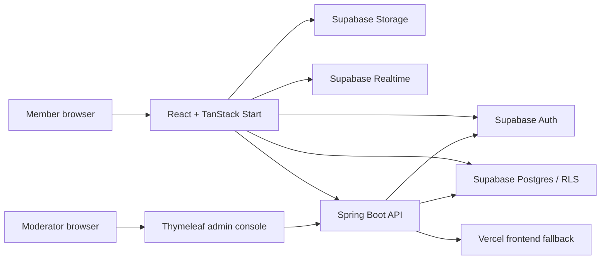

# TAKKA - Complete Project Details

> Project reference for developers, reviewers, administrators, and academic presentation.
> Last reviewed against the repository on September 11, 2026.

## 1. Project Overview

**TAKKA** is a bilingual university discovery and student community platform designed for students in Myanmar. It helps prospective students research and compare universities, helps current students share reliable campus experience, and gives both groups a structured place to ask questions, communicate, and discover academic opportunities.

The product has two connected applications:

1. **Member application** - a responsive React web application for students and prospective students.
2. **Administration console** - a server-rendered Spring Boot application for moderation, verification, and catalog management.

Supabase provides authentication, PostgreSQL data storage, Row Level Security (RLS), file storage, database functions, and realtime updates. The Java backend performs privileged operations with server-only credentials and can relay Supabase traffic or serve the member frontend when direct network access is unreliable.

## 2. Problem And Goals

Students in Myanmar often need to gather university information from disconnected or incomplete sources. TAKKA brings university data and student experience together in one system.

The main goals are:

- Make university information easier to discover and compare.
- Support informed decisions with explainable university matching.
- Connect prospective students with verified current students.
- Provide useful community discussions, questions, and answers.
- Surface scholarships, internships, competitions, workshops, and events.
- Protect members through verification, reporting, moderation, and access controls.
- Remain usable on desktop and mobile and under unreliable regional network conditions.
- Support both English and Myanmar language interfaces.

## 3. User Roles

### Prospective Student

A prospective student is looking for a university. Registration records preferred fields of study, city, and degree-level interests. This user can:

- Browse, search, filter, save, and compare universities.
- Use the university matcher.
- View campuses, departments, programs, and approved university photos.
- Read and create community posts and questions.
- Answer questions, comment, vote, like, and save content.
- Join public university group conversations and use direct messaging.
- Browse and submit academic opportunities.
- Maintain a public member profile and account settings.

### Current University Student

A current student registers with a university, department, student ID, and academic details. In addition to the general member features, this user can:

- Submit proof for student verification.
- Contribute university photos after verification.
- Join the private, opt-in study-buddy matcher after verification.
- Accept or decline study requests before a chat can begin.
- Share first-hand university and department experience.

### Moderator

A moderator uses the separate Java administration console. A moderator can:

- Review user reports.
- Block and unblock accounts.
- Verify or reject student verification requests.
- Remove and restore community posts.
- Review submitted opportunities.
- Review submitted university photos.
- Inspect the moderation audit trail.

### Super Administrator

A super administrator has all moderator permissions and can additionally:

- Delete member accounts.
- Create and edit university records.
- Publish or archive universities.
- Manage campuses, departments, and programs.
- Maintain the curated university catalog.

Administrator access is not hard-coded. An administrator must be a Supabase Auth user with an active row in `public.admin_users`.

## 4. Main Product Features

### Authentication And Registration

- Email and password authentication through Supabase Auth.
- Separate onboarding flows for current and prospective students.
- Mobile-friendly native/select controls for university, department, city, and study preferences.
- Authentication fallback through the Java Supabase proxy when a client cannot reach Supabase directly.
- Protected application routes through `AuthGuard`.
- Account moderation status checked by the backend.

### University Directory

- Searchable and filterable Myanmar university catalog.
- University summary cards and detailed university pages.
- Location, institution type, establishment year, website, description, and contact data.
- Related campuses, departments, and degree programs.
- Shortlisting with saved universities.
- Approved cover and community-contributed university photography.
- Published/archive lifecycle controlled by administrators.

### University Matcher And Comparison

- Preference-based matching for field, city, degree level, and university type.
- Adjustable importance levels for major matching priorities.
- Explainable result scores and reasons instead of an unexplained ranking.
- Selection and side-by-side comparison of up to three universities.
- Compatibility normalization for legacy values such as `IT`, `ICT`, `CS`, `BCSC`, and `Any`.
- Database-side recommendation functions for consistent results.

### Community Feed

- Community-wide and profile-only posts.
- Text and optional image attachments.
- Best/newest feed sorting and pagination.
- Likes, saved posts, comments, nested replies, and comment votes.
- Soft deletion for posts and comments.
- University tagging and profile-linked authorship.
- Report actions backed by the Java moderation API.

### Questions And Answers

- Searchable questions with tags.
- Answers and answer voting.
- Question-owner accepted answers.
- Notifications for new answers and answer votes.
- Dedicated question detail threads.

### Messaging

- Direct conversations between members.
- University group conversations.
- Join and leave controls for discoverable groups.
- Persisted message history with pagination.
- Realtime message and conversation-list updates.
- Unread message counts in desktop and mobile navigation.
- Study-buddy chat opens only after a request is accepted.

### Notifications

- In-app notification center.
- Realtime unread-count updates.
- Mark one or all notifications as read.
- Notifications for community, messaging, opportunity, and study-buddy activity.
- Due-opportunity reminder delivery through a protected database function.

### Student Success Hub

The Student Hub is divided into three task-focused areas.

#### Decision Center

- University matching preferences.
- Ranked, explained recommendations.
- Shortlisting and comparison of up to three choices.

#### Opportunities

- Scholarships, internships, competitions, workshops, and events.
- Search, category, deadline, and saved-item filters.
- Deadline urgency indicators.
- Official source links.
- Member submissions enter a pending moderation queue.
- Bookmarks and in-app deadline reminders.

#### Study Buddies

- Available only to verified current students.
- Private opt-in matching profile.
- Matching by topic, goal, study mode, language, availability, and department.
- Request, accept, decline, cancel, dismiss, and block flows.
- Mutual consent before messaging is available.

### Profiles And Settings

- Public member profile pages.
- Editable name, bio, avatar, and role-specific academic information.
- Saved posts and university interests.
- Student verification status.
- English/Myanmar language preference.
- Responsive desktop sidebar and mobile bottom navigation.

### Administration Console

- Separate sign-in and secure cookie session.
- CSRF protection for state-changing actions.
- Overview dashboard with moderation metrics.
- Reports queue and resolution workflow.
- Member search, status controls, deletion, and student verification.
- Post removal and restoration.
- University create/edit/publish/archive workflows.
- Campus, department, and program catalog management.
- Opportunity and university-photo review queues.
- Immutable audit records for administrative actions.
- English and Myanmar message bundles.

## 5. Route Map

### Public Member Routes

| Route             | Purpose                                                    |
| ----------------- | ---------------------------------------------------------- |
| `/`               | Public entry page                                          |
| `/get-started`    | Select current-student or prospective-student registration |
| `/register/:role` | Role-specific account creation                             |
| `/login`          | Member sign-in                                             |

### Authenticated Member Routes

| Route                    | Purpose                               |
| ------------------------ | ------------------------------------- |
| `/dashboard`             | Community home/feed                   |
| `/universities`          | University directory                  |
| `/universities/:id`      | University details                    |
| `/hub?tab=decide`        | University matcher and comparison     |
| `/hub?tab=opportunities` | Opportunity board                     |
| `/hub?tab=buddies`       | Study-buddy matching                  |
| `/questions`             | Question list and creation            |
| `/questions_/:id`        | Question and answer thread            |
| `/posts/:id`             | Post and comment thread               |
| `/messages`              | Direct and university-group messaging |
| `/notifications`         | Notification center                   |
| `/profile`               | Current member profile                |
| `/profiles/:id`          | Another member's public profile       |
| `/settings`              | Account and profile settings          |

### Backend And Admin Routes

| Route                      | Purpose                                 |
| -------------------------- | --------------------------------------- |
| `/actuator/health`         | Deployment health check                 |
| `/api/account/status`      | Authenticated account moderation status |
| `/api/reports`             | Submit a user/content report            |
| `/api/supabase/**`         | Restricted Supabase network proxy       |
| `/admin/login`             | Administrator sign-in                   |
| `/admin`                   | Administration overview                 |
| `/admin/reports`           | Reports queue                           |
| `/admin/members`           | Account and verification management     |
| `/admin/posts`             | Post moderation                         |
| `/admin/universities`      | University management                   |
| `/admin/catalog`           | Campus, department, and program catalog |
| `/admin/opportunities`     | Opportunity review                      |
| `/admin/university-photos` | University photo review                 |
| `/admin/audit`             | Moderation audit log                    |

Unknown member-side GET/HEAD routes on the Railway service are forwarded to the configured Vercel frontend. `/api/**` and `/admin/**` always remain local to Spring Boot.

## 6. Technical Architecture



### Frontend

- React 19 and TypeScript.
- TanStack Start and file-based TanStack Router.
- TanStack Query for asynchronous state, cache invalidation, and loading/error states.
- Vite 8 and Nitro for development and production builds.
- Tailwind CSS 4 for styling.
- Radix UI primitives for accessible dialogs, selects, tabs, alerts, labels, and avatars.
- Lucide React icons.
- Sonner toasts for user feedback.
- Responsive layouts with safe-area support for mobile devices.

### Backend

- Java 21.
- Spring Boot 4.1.1.
- Spring MVC, Security, Validation, Actuator, and Thymeleaf.
- Server-side Supabase gateway using publishable and secret keys with strict separation.
- Cookie-based administrator sessions and CSRF-protected forms.
- Message bundles for English and Myanmar administration UI.

### Platform Services

- Supabase Auth for member and administrator identities.
- PostgreSQL for application data and recommendation functions.
- Row Level Security for browser-accessible data.
- Supabase Storage for avatars, post images, and university photos.
- Supabase Realtime for notifications and messaging.
- Vercel for the primary frontend deployment.
- Railway for Spring Boot, admin, API, Supabase proxy, and frontend fallback.

## 7. Frontend Structure

```text
src/
|- assets/                 Static source assets
|- components/             Feature and shared React components
|  |- ui/                  Reusable Radix/Tailwind primitives
|  |- app-shell.tsx        Responsive application navigation and layout
|  |- community.tsx        Main community experience
|  |- student-hub.tsx      Matcher, opportunities, and study buddies
|  |- messages.tsx         Conversation UI
|  |- notifications.tsx    Notification center
|  `- live-app-pages.tsx   Route-level feature pages
|- lib/
|  |- api.ts               Java backend API client
|  |- auth.tsx             Supabase authentication context
|  |- data.ts              Core Supabase data access
|  |- hub-data.ts          Student Hub data access and matching normalization
|  |- database.types.ts    Generated Supabase database types
|  |- i18n.tsx             Localization provider and translation lookup
|  `- supabase.ts          Supabase client and proxy configuration
|- locales/                English and Myanmar translations
|- routes/                 TanStack file-based routes
|- router.tsx              Router construction
|- server.ts               TanStack/Nitro server entry
|- start.ts                Client start entry
`- styles.css              Global theme tokens and Tailwind styles
```

## 8. Backend Structure

```text
backend/src/main/
|- java/com/takka/
|  |- account/             Account-status API
|  |- admin/
|  |  |- console/          Thymeleaf controllers
|  |  |- form/             Validated form models
|  |  |- mapper/           Supabase response mapping
|  |  |- model/            Administration domain models
|  |  |- repository/       Supabase persistence queries
|  |  |- service/          Moderation and catalog business logic
|  |  `- session/          Administrator sign-in and sessions
|  |- common/              API exception handling
|  |- config/              Security and internationalization
|  |- frontend/            Frontend fallback proxy
|  |- reports/             Report submission API
|  |- security/            Supabase bearer-token authentication
|  `- supabase/            Restricted Supabase gateway/proxy
`- resources/
   |- templates/admin/     Administration HTML templates
   |- static/admin/        Administration CSS
   |- messages*.properties Translated backend copy
   `- application.yml      Runtime configuration
```

## 9. Database Model

The schema is managed by ordered SQL files in `supabase/migrations/`.

### Identity And Profiles

- `profiles` - shared member identity, role, name, avatar, bio, and timestamps.
- `student_profiles` - current university, department, student details, and verification state.
- `prospective_profiles` - intended field, city, and degree preferences.
- `admin_users` - administrator role and active status linked to Supabase Auth.
- `account_moderation` - blocked/deleted account state and moderation reason.

### University Catalog

- `universities` - primary university metadata and publishing state.
- `campuses` - university campus locations.
- `departments` - university departments and fields.
- `programs` - degree programs attached to departments.
- `saved_universities` - member shortlists.
- `university_photos` - submitted, approved, rejected, or withdrawn university images.

### Community

- `posts`, `post_likes`, and `saved_posts`.
- `comments` and `comment_votes`.
- `questions`, `question_tags`, `answers`, and `answer_votes`.
- Database triggers keep denormalized like/vote/comment counts synchronized.

### Messaging And Notifications

- `conversations` - direct or university-group threads.
- `conversation_members` - membership and read state.
- `messages` - persisted conversation messages.
- `notifications` - user-specific community and system events.

### Student Hub

- `matcher_preferences` - saved university-matching priorities.
- `opportunities` - submitted and approved opportunity listings.
- `opportunity_bookmarks` - saved opportunities.
- `opportunity_reminders` - in-app deadline reminders.
- `study_buddy_profiles` - opt-in matching details.
- `study_buddy_requests` - pending, accepted, declined, or cancelled requests.
- `study_buddy_dismissals` - hidden or blocked matches.

### Moderation

- `reports` - reports against accounts or content.
- `moderation_actions` - immutable administrative audit entries.

### Important Database Functions

- `recommend_universities` and `recommend_universities_v2` - explainable university matching.
- `join_university_group` - controlled group creation and membership.
- `start_direct_conversation` - safe, deduplicated direct messaging.
- `set_accepted_answer` - question-owner answer acceptance.
- `soft_delete_post` and `soft_delete_comment` - author-controlled soft deletion.
- `deliver_due_opportunity_reminders` - notification delivery for saved deadlines.

## 10. Security Model

- The browser receives only a Supabase publishable key.
- The Supabase secret key is server-only and must never use a `VITE_*` variable.
- RLS is enabled on browser-accessible tables.
- Policies constrain records by authenticated user, ownership, membership, publication state, verification state, and moderation state.
- Blocked users are restricted from write operations.
- Administrator tables deny direct anonymous/authenticated browser access.
- Backend bearer tokens are validated against Supabase before protected API actions.
- Administrator accounts require both valid Auth credentials and an active `admin_users` record.
- Administrative forms use CSRF protection and secure server sessions.
- Moderation actions are audit logged and protected from modification.
- Uploaded images are type- and size-validated and stored under user-owned paths.
- Study-buddy discovery requires verification and messaging requires acceptance.

Before a public launch, leaked-password protection, custom SMTP, backups, monitoring, and abuse controls should be enabled and reviewed in Supabase.

## 11. Localization And Accessibility

- Member UI translations live in `src/locales/en.json` and `src/locales/my.json`.
- The locale checker requires both files to contain the same keys.
- Backend translations live in `messages.properties` and `messages_my.properties`.
- Semantic labels, keyboard-capable Radix primitives, visible focus states, and descriptive empty/loading/error states support accessibility.
- Desktop and mobile navigation are intentionally different for efficient use at each screen size.
- Mobile layouts account for device safe areas and keep primary actions reachable.

## 12. Local Development

### Requirements

- Node.js 20 or newer.
- npm.
- Java 21.
- Maven.
- A Supabase project with the TAKKA baseline schema and all checked-in migrations applied.

### Environment Variables

Copy `.env.example` to `.env.local` and provide:

```ini
VITE_SUPABASE_URL=https://your-project-ref.supabase.co
VITE_SUPABASE_PUBLISHABLE_KEY=your-publishable-key
VITE_TAKKA_API_URL=http://localhost:8080
VITE_SUPABASE_PROXY_URL=https://your-deployed-api.example.com/api/supabase
```

`VITE_SUPABASE_PROXY_URL` is optional. It is useful when the local network cannot reach `*.supabase.co` reliably.

Set backend-only variables in the terminal that starts Spring Boot:

```powershell
$env:SUPABASE_URL="https://your-project-ref.supabase.co"
$env:SUPABASE_PUBLISHABLE_KEY="your-publishable-key"
$env:SUPABASE_SECRET_KEY="your-secret-server-key"
$env:TAKKA_FRONTEND_ORIGIN="http://localhost:5173"
```

Never commit `.env.local` or any secret/service-role key.

### Start The Applications

Install frontend dependencies and start the member app:

```powershell
$env:NODE_OPTIONS="--use-system-ca"
npm install
npm run dev
```

Start the backend in a second terminal:

```powershell
npm run dev:backend
```

Default local URLs:

- Member app: `http://127.0.0.1:5173`
- Administration console: `http://localhost:8080/admin`
- Backend health: `http://localhost:8080/actuator/health`

## 13. Database Setup And Migrations

For an existing TAKKA baseline, apply every checked-in SQL migration in filename order. The current
migration sequence is:

1. Administration and moderation foundation.
2. Community expansion and RLS hardening.
3. Myanmar university directory and publishing scope.
4. University photos, recommendations, moderation, and audit support.
5. Verified catalog expansion and collected university-data import.
6. Complete Q&A and notification flows.
7. Student Hub notification types and core tables.
8. Student verification administration.
9. University matcher legacy-preference normalization.

The current Student Hub migration versions are `20260909174128`, `20260909174138`, and `20260909174235`; matcher normalization is `20260909175239`.

After schema changes, regenerate `src/lib/database.types.ts` so frontend types remain synchronized with production.

## 14. Common Commands

| Command                              | Purpose                                    |
| ------------------------------------ | ------------------------------------------ |
| `npm run dev`                        | Start frontend development server          |
| `npm run dev:backend`                | Start Spring Boot from the repository root |
| `npm run build`                      | Create the production frontend build       |
| `npm run preview`                    | Preview the frontend production build      |
| `npm run lint`                       | Run ESLint and locale consistency checks   |
| `npm run format`                     | Format repository files with Prettier      |
| `mvn -f backend/pom.xml test`        | Run backend tests                          |
| `pwsh ./scripts/language-report.ps1` | Report code volume by language             |

## 15. Testing And Quality Controls

The repository includes backend tests covering:

- Application startup.
- Supabase proxy restrictions.
- Frontend fallback routing.
- Authentication and administrator sessions.
- Security and role authorization.
- Accounts, reports, posts, opportunities, universities, photos, and catalog moderation.
- Audit trail behavior.
- Mapping, pagination, JSON, timestamp, and utility behavior.
- English/Myanmar administration messages.

Frontend quality checks include TypeScript compilation during build, ESLint, React Hooks rules, Prettier integration, and translation-key parity checks. Critical flows should also be manually verified at desktop and mobile widths, especially registration selectors, authentication fallback, university matching, messaging, and moderation decisions.

## 16. Deployment

### Frontend On Vercel

`vercel.json` configures TanStack Start, supplies public build-time endpoints, and rewrites `/api/supabase/*` to Supabase. Production environment values should also be maintained through the Vercel project settings.

Primary responsibilities:

- Build and host the member application.
- Serve static assets and client routes.
- Provide the same-origin Supabase rewrite for network resilience.

### Backend On Railway

The Spring Boot service listens on Railway's `PORT` and provides:

- Administration console.
- Report and account-status APIs.
- Restricted Supabase proxy.
- Health endpoint.
- Frontend fallback for known member routes.

Current backend host:

`https://campus-connect-backend-production-4525.up.railway.app`

Required Railway variables include Supabase server credentials, the accepted frontend origin, and the Vercel frontend upstream. CORS permits the configured frontend and Railway-hosted frontend fallback while protected paths remain server-controlled.

### Supabase Production Checklist

- Apply all repository migrations.
- Configure the production Site URL and allowed Auth redirect URLs.
- Keep email confirmation enabled for public use.
- Configure custom SMTP for confirmation and password-reset email.
- Enable leaked-password protection.
- Review Security and Performance advisors after migrations.
- Configure backups, monitoring, rate limits, and abuse prevention.

## 17. Creating The First Administrator

Create a normal Supabase Auth account using an email address controlled by the administrator. Then promote it once in the Supabase SQL editor:

```sql
insert into public.admin_users (user_id, role, is_active)
select id, 'SUPER_ADMIN', true
from auth.users
where lower(email) = lower('your-email@gmail.com')
on conflict (user_id) do update
set role = excluded.role,
    is_active = true,
    updated_at = now();
```

Use that account's own email and password at `/admin/login`. There is deliberately no shared administrator email or password in the source code.

## 18. Current Operational Notes

- The application intentionally uses live Supabase data and has no mock-data fallback.
- Empty production tables produce explicit empty states rather than fabricated content.
- The Java fallback exists because Vercel or Supabase domains can be slow or unreachable on some local networks.
- Matcher values are normalized in both the client and SQL to support older profile data.
- University and opportunity content requires administrative curation to remain accurate.
- `database.types.ts` is synchronized with the complete production schema, including Student Hub tables and functions.
- Some database performance-advisor suggestions, such as indexes on newer foreign keys, should be reviewed as production traffic grows.

## 19. Suggested Future Enhancements

- University reviews with verified-student weighting and anti-abuse controls.
- Admission requirements, intake dates, tuition ranges, and application checklists.
- Personalized deadline calendar and email/push reminders.
- Richer scholarship eligibility matching.
- Verified university representatives and official announcements.
- Content search across posts, questions, universities, and opportunities.
- Moderation analytics and configurable abuse-rate limits.
- Automated frontend component and end-to-end browser tests.
- Privacy controls for profile fields and direct-message requests.
- Offline-friendly university browsing for unreliable connections.

## 20. Project Identity

- **Product name:** TAKKA
- **Repository package name:** `takka`
- **Original repository context:** Campus Connect
- **Primary audience:** Current and prospective university students in Myanmar
- **Interface languages:** English and Myanmar
- **Application type:** Responsive full-stack web platform
- **License:** No license file is currently included; repository usage rights should be clarified before external distribution.
