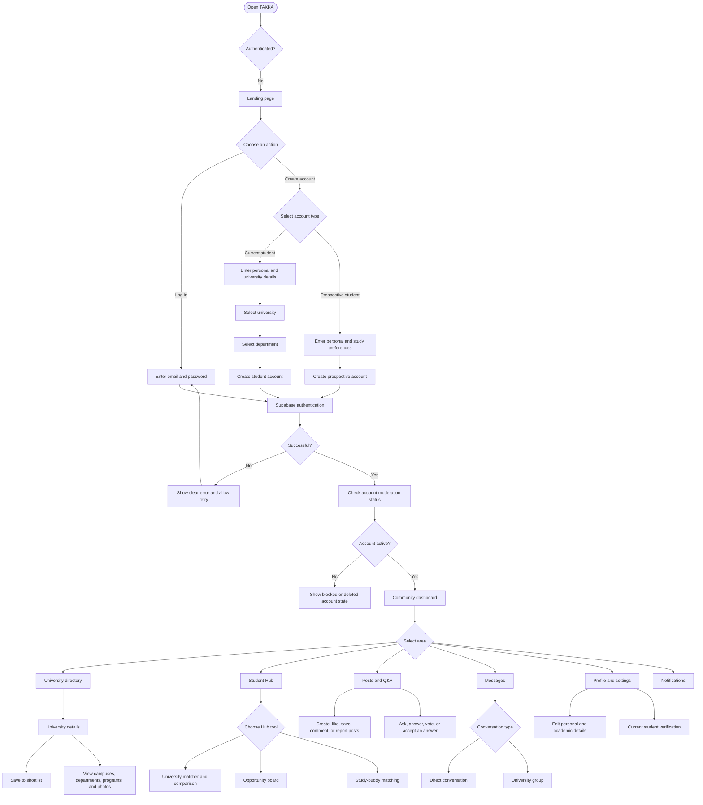
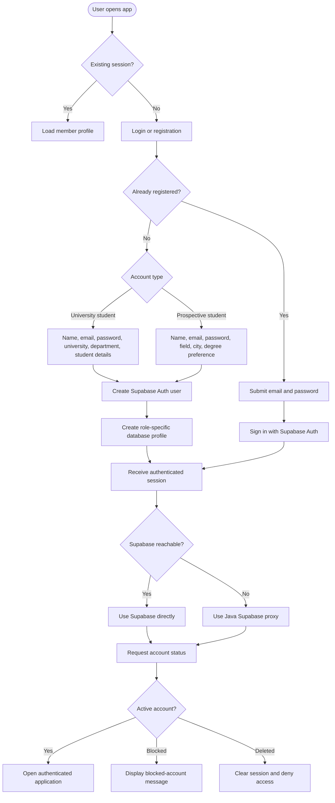
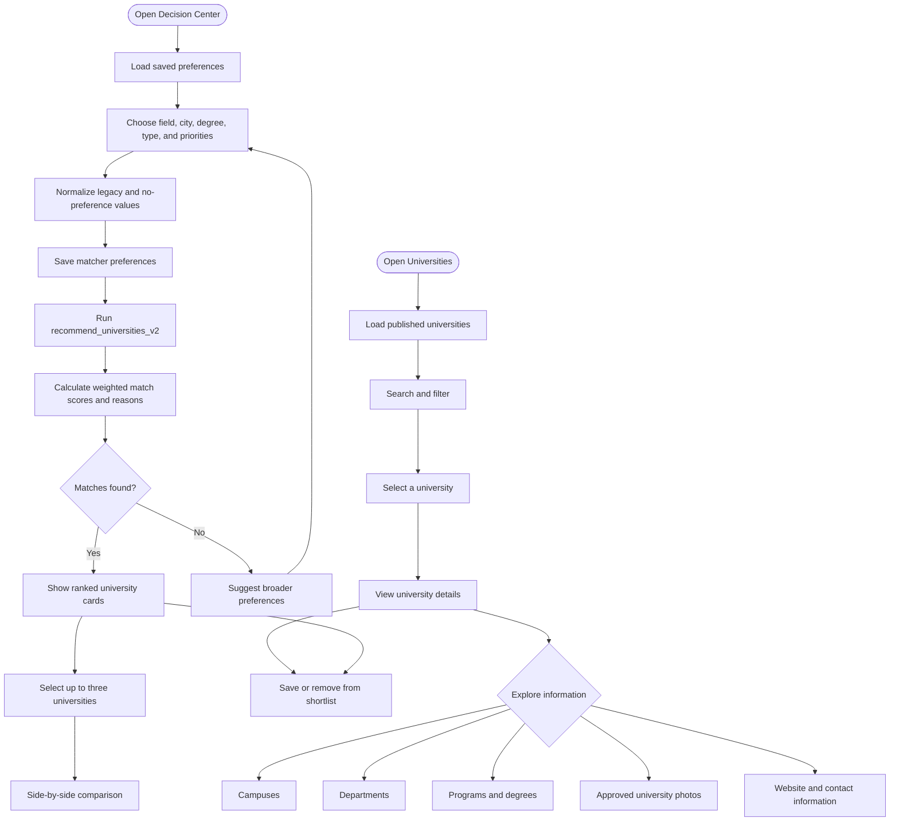
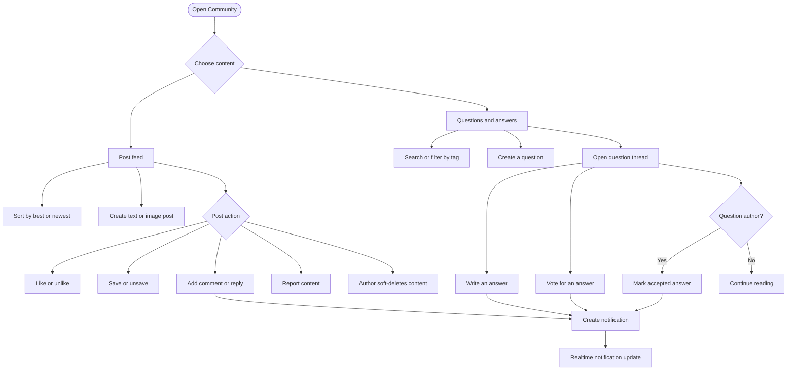
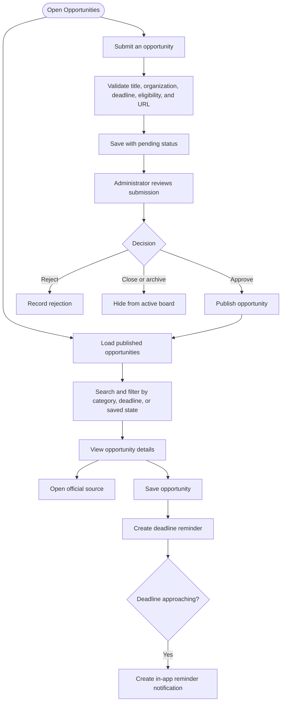
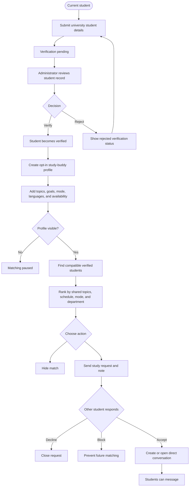
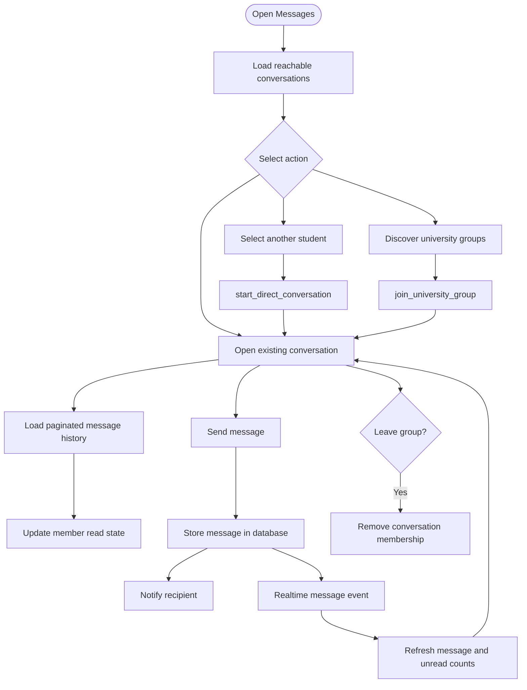
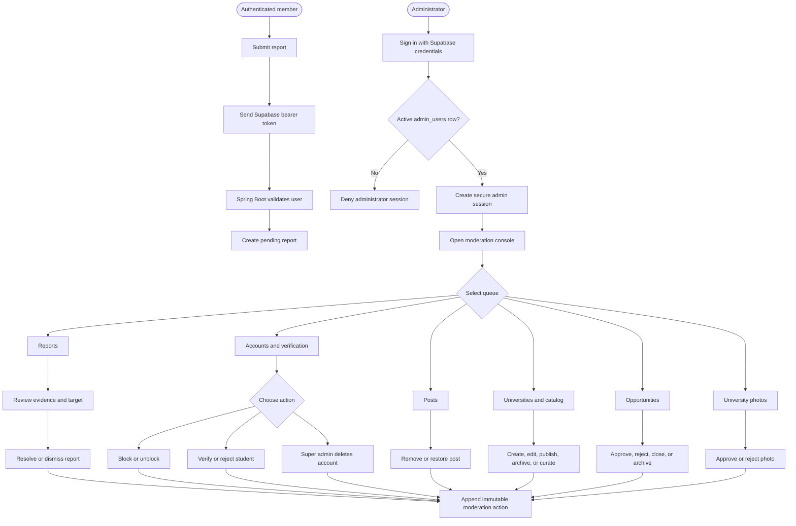
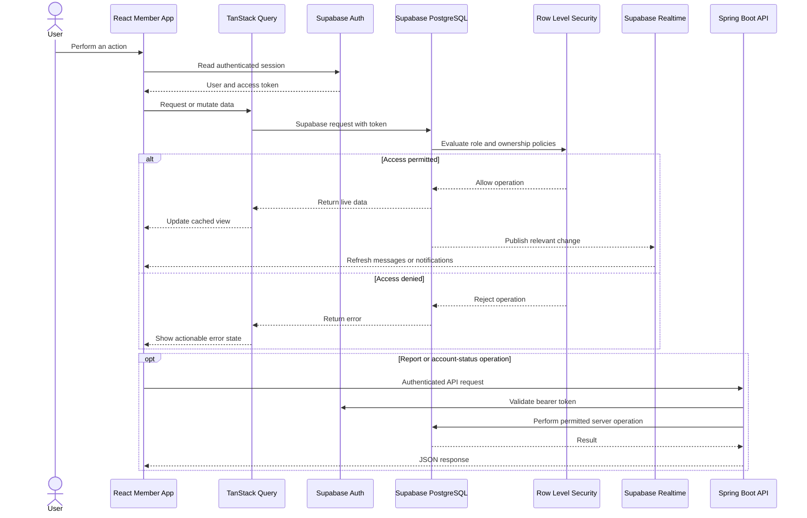
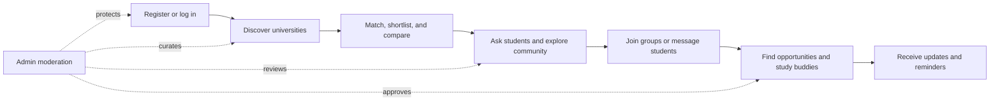

# TAKKA Project Flowcharts

> Visual reference for the member experience, administration workflow, system architecture, and data flow.

## 1. Complete Product Flow



## 2. Authentication And Registration Flow



## 3. University Discovery And Matcher Flow



## 4. Community And Q&A Flow



## 5. Opportunity Flow



## 6. Student Verification And Study-Buddy Flow



## 7. Messaging Flow



## 8. Reporting And Moderation Flow



## 9. Application Data Flow



## 10. Deployment And Network Fallback Flow

```mermaid
flowchart TD
    Browser([User browser]) --> Primary{Vercel reachable?}
    Primary -- Yes --> Vercel[Vercel member frontend]
    Primary -- No --> Railway[Railway frontend fallback URL]

    Railway --> RouteType{Request path}
    RouteType -- Member GET or HEAD --> Upstream[Relay configured Vercel frontend]
    RouteType -- /api/** --> SpringAPI[Spring Boot API]
    RouteType -- /admin/** --> AdminConsole[Spring Boot admin console]

    Vercel --> DataPath{Supabase reachable directly?}
    Upstream --> DataPath
    DataPath -- Yes --> Supabase[Supabase Auth, Database, Storage, and Realtime]
    DataPath -- No --> Proxy[Same-origin or Railway Supabase proxy]
    Proxy --> Supabase

    SpringAPI --> Supabase
    AdminConsole --> SpringAPI

    Health[Railway health monitor] --> Actuator[/actuator/health]
    Actuator --> SpringAPI
```

## 11. Simplified Presentation Flow



## 12. Flow Summary

TAKKA begins with role-based registration and secure authentication. Members then move through a connected cycle of university discovery, explainable decision support, community learning, messaging, and academic growth. Supabase enforces user-level data access, while the Spring Boot administration console handles privileged moderation and catalog operations. Vercel is the primary member-app host, with Railway providing backend services and a network-resilient fallback path.
